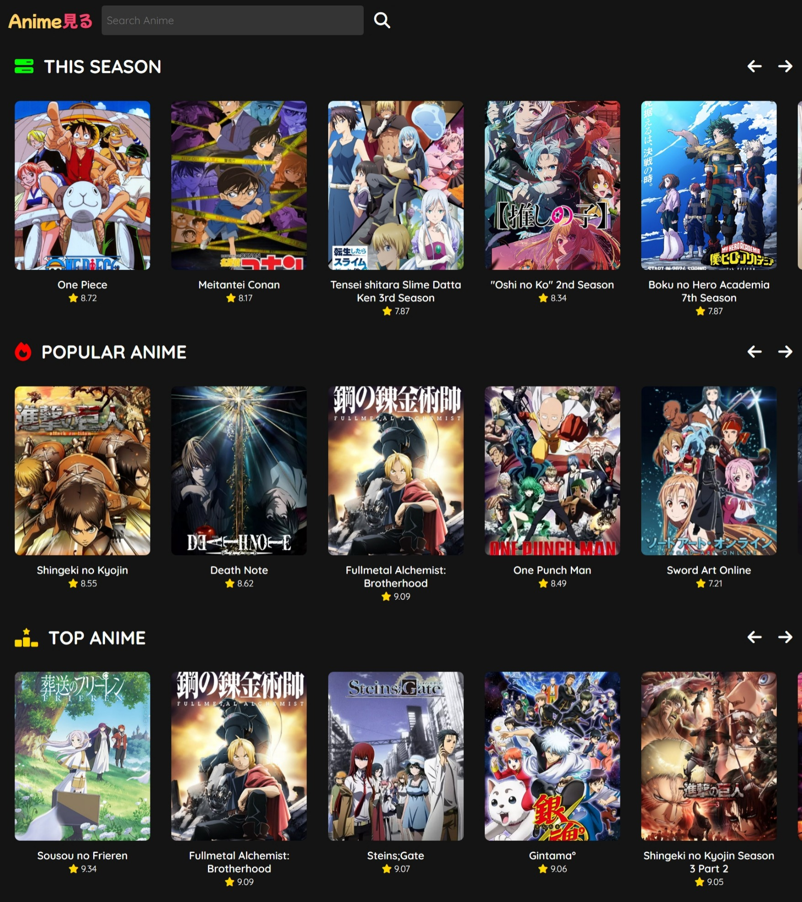

# Disclaimer
This application uses the MyAnimeList API but is not endorsed or certified by MyAnimeList. All data provided by the API is owned by MyAnimeList. For more information, please visit MyAnimeList's official website.

# AnimeMiru App
**AnimeMiru** is a simple web application that allows users to explore and discover information about their favourite anime series. It leverages the **MyAnimeList API**, which provides anime-related data.



## Features

- **Search Anime**: Users can search for anime titles by entering keywords. The app fetches relevant data from the MyAnimeList API and displays it.
- **Anime Details**: When users click on an anime title, they can view detailed information, including the synopsis, release date, episode count, and more.

## Technologies Used

- **HTML**: The basic structure of the app is built using HTML.
- **CSS**: Styling and layout are handled using CSS.
- **JavaScript**: The app uses JavaScript to interact with the MyAnimeList API, handle user input, and dynamically update the UI.
- **Django**: The web application is built using the Django framework, providing a robust backend structure.

## Setup

To set up the project locally, follow these steps:

1. **Clone the repository:**

   ```bash
   git clone https://github.com/atharva-kakarot/AnimeMiru-Django.git
